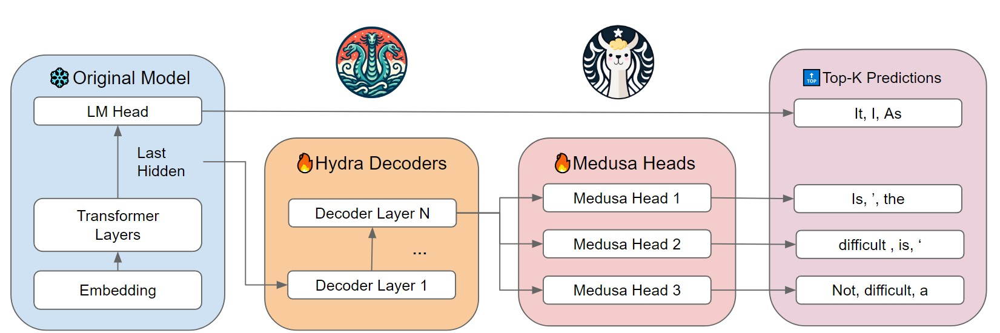

<div align="center"><h1>&nbsp;Hydra: Improving Multi-Head Decoding for LLM Generation (UMich EECS595 Project)</h1></div>

## Introduction

Hydra is an LLM generation framework that aims to improve the multi-head decoding in [Medusa](https://github.com/TimDettmers/bitsandbytes).


<div align="center">
  <picture>
  
  </picture>
  <br>
  <div align="left" width="90%">
  <em>Hydra framework introduces new decoding layers to further enhance the predictive capabilities of LLMs. By initializing these layers with the base model’s weights and diverging the computation path of hidden states, Hydra aims to improve both the efficiency and accuracy of token generation, offering a promising direction for future LLM advancements.</em>
  </div>
  <br>
</div>

## Requirements & Installation

### Recommended requirements 
- python==3.10
- pytorch==1.13.0
- transformers==4.35.2
- tokenizers==0.15.0
- wandb==0.16.0

(This is the environment used for the final project evaluation. A different library version may lead to compatibility issue.)

The requirements can best be fulfilled by installing pytorch via anaconda. You can install PyTorch by following the ["Get Started"](https://pytorch.org/get-started/locally/) instructions on the official website. 

### Hardware requirements
NVIDIA Turing (RTX 20xx; T4) or Ampere GPU (RTX 30xx; A4-A100); (a GPU from 2018 or older).

(Make sure you make enough GPU memory!!!)

### Installation 
Compile Hydra from source
```bash
git clone https://github.com/FasterDecoding/Medusa.git
cd Medusa
pip install -e .
```

## Model Weights
We uploaded three model weights to Hugging Face for users to try.

| Base Model | Description | Hugging Face Repo |
| --- | ----------- | --- |
| Vicuna-7b | Medusa Model (Original) | [FasterDecoding/medusa-vicuna-7b-v1.3](https://huggingface.co/FasterDecoding/medusa-vicuna-7b-v1.3) |
| Vicuna-7b | Medusa Model - 3 Head (Ours) | [Rango2000/medusa-3h-vicuna-7b-v1.3](https://huggingface.co/Rango2000/medusa-3h-vicuna-7b-v1.3) |
| Vicuna-7b | Hydra Model - 3 Head - 1 Decoding Layer (Ours) | [shiqihe/hydra-decoder-1l-vicuna-7b-v1.3](https://huggingface.co/shiqihe/hydra-decoder-1l-vicuna-7b-v1.3) |
| Vicuna-7b | Hydra Model - 3 Head - 2 Decoding Layer (Ours) | [shiqihe/hydra-decoder-2l-vicuna-7b-v1.3](https://huggingface.co/shiqihe/hydra-decoder-2l-vicuna-7b-v1.3) |


## Inference

We currently support single-GPU inference with a batch size of 1, which is the most common setup for local model hosting.

You can use the following command to launch a CLI interface:
```bash
# optional
CUDA_VISIBLE_DEVICES=0
# run cli
python -m medusa.inference.cli --model [path/repo of hydra decoder]
````
You can also pass `--load-in-8bit` or `--load-in-4bit` to load the base model in quantized format. If you download the base model elsewhere, you may override base model name or path with `--base-model  [path of base model]`.

## Training
For training, please install:
```bash
pip install -e ".[train]"
```
### Prepare the data
We take a public version of the ShareGPT dataset, which is a subset of the Vicuna training data. For other models, you can use the corresponding training dataset.
```bash
git clone https://huggingface.co/datasets/Aeala/ShareGPT_Vicuna_unfiltered
```
Remark: If you haven't installed `git-lfs`, please install it before cloning:
```bash
git lfs install
```
### Train the model
The training setup follows [FastChat](https://github.com/lm-sys/FastChat#fine-tuning), but with a much larger learning rate because we freeze the original model and only train the new decoders and heads. Here is the training command for the Vicuna-7b model on 1 NVIDIA A40 GPU. You can modify the script to fit your own setup. For larger models, we use the same setup. You can also use `--load_in_8bit` or `--load_in_4bit` to load the base model in quantized format.
```bash
torchrun --nproc_per_node=1 medusa/train/train.py --model_name_or_path lmsys/vicuna-7b-v1.3 \
    --data_path ShareGPT_Vicuna_unfiltered/ShareGPT_V4.3_unfiltered_cleaned_split.json \
    --bf16 True \
    --output_dir test \
    --num_train_epochs 1 \
    --per_device_train_batch_size 2 \
    --per_device_eval_batch_size 2 \
    --gradient_accumulation_steps 4 \
    --evaluation_strategy "no" \
    --save_strategy "no" \
    --learning_rate 1e-3 \
    --weight_decay 0.0 \
    --warmup_ratio 0.1 \
    --lr_scheduler_type "cosine" \
    --logging_steps 1 \
    --tf32 True \
    --model_max_length 3000 \
    --lazy_preprocess True \
    --medusa_num_heads 3 \
    --medusa_num_layers 1\
    --medusa_num_decoder_layers 2
```

